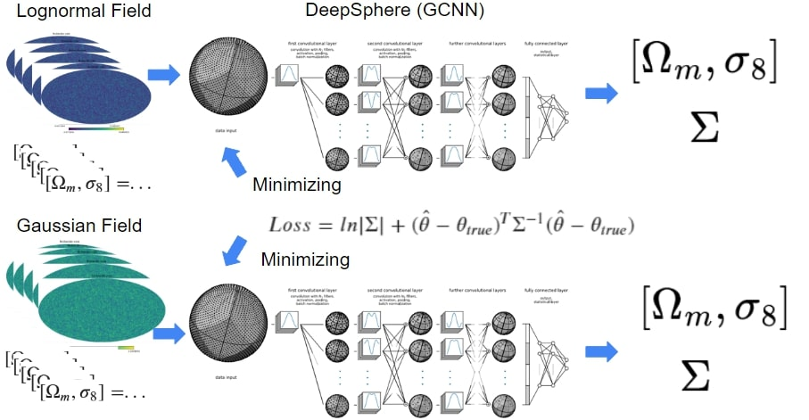

## Section 3: GCNN Inference
The complementary aspect of simulation is inference, where we aim to estimate the cosmological parameters from the density field. In my inference pipeline, I utilize the DeepSphere framework, which incorporates graph convolutional neural networks (GCNN) instead of summarizing data to a two-point function. This directory contains my code for the training steps of GCNN models and data preprocessing. The content in this subdirectory primarily aligns with Chapter 7 of my Master's thesis  [[Masterarbeit.pdf]](Masterarbeit.pdf).

## Structure of Inference Pipeline

The primary focus of this thesis is to investigate the validity of the Lognormal model approximation. As such, I trained GCNN networks using the Lognormal model, and additionally generated the Gaussian model for comparison. We can also assess the validity of our neural network model by comparing it with the Fisher contour.

(i) **Inputs:** The input data consists of maps that have been downgraded to NSIDE=128, along with cosmological parameters as labels. For the Gaussian model, I used Gaussian maps as training data, and for the Lognormal model, I used lognormal maps as training data. Apart from the input data, the model architecture and hyperparameters are the same for both models. 

(ii) **DeepSphere:** In contrast to CNN, GCNN can handle input data that is not defined in Euclidean space. DeepSphere is a GCNN package designed for spherical data, such as HEALPix maps. I employed layers from DeepSphere to process full-sky maps.

(iii) **Loss Function:** The loss function used is the negative Gaussian log-likelihood loss. This loss function provides estimates of parameters and the covariance matrix under the Gaussian assumption.

(iV) **Outouts:** The first two outputs are estimates of model parameters, specifically $\Omega_m$ and $\sigma_8$. The remaining three outputs are estimates of the covariance matrix.

## Contents

In this directory, you'll find the following code and Python notebooks:

1. **Downgrading_Validation.ipynb:** This notebook examines the effect of downgrading using KL divergence.
   
2. **Loss_comparison.ipynb:** This notebook visualizes the loss and metric curves during training steps. It includes the content of Appendix B.

In the subdirectory **Data_Preprocessing**, you can find the source code for the downgrading used in my thesis:

3. **Down_grade_Training.py:** Multiprocessing of *healpy.udgrad* for speeding up.
   
4. **Down_grade_Test.py:** Same as **Down_grade_Training.py**.
   
5. **Down_grade_Validation.py:** Same as **Down_grade_Training.py**.
 
6. **Get_Cl.py:** Multiprocessing of *healpy.anafast* for speeding up.

7. **Making_npz_file.py:** Creating a *.npz* file.

8. **Making_Test_npz_file.py:** Same as **Making_npz_file.py**.
   
In the subdirectory **GCNN_Models**, you can find the source code for the trained models used in my thesis:

9. **Gauss_model.ipynb:** Constructs Gaussian model 1 in my thesis [[Masterarbeit.pdf]](Masterarbeit.pdf).

10. **Gauss_model_2.ipynb:** Constructs Gaussian model 2 in my thesis [[Masterarbeit.pdf]](Masterarbeit.pdf).

11. **lognormal_model.ipynb.ipynb:** Constructs lognormal model 1 in my thesis [[Masterarbeit.pdf]](Masterarbeit.pdf).

12. **lognormal_model_2.ipynb.ipynb:** Constructs lognormal model 2 in my thesis [[Masterarbeit.pdf]](Masterarbeit.pdf).

13. **cov_by_hand.py:**  Calculates sample covariance and $\chi^2$. I don't remember why I didn't just use *numpy*.

14. **Loss_mean.py:** Calculates the loss function and metrics.

15. **standard_2D.py:** Stadidizing method for data preprocessing. I did not end up using it.

16. **__init__.py, build_model.py, gnn_layers_custom.py, gnn_transformers_custom.py, utils_custom.py:** Customized modules of *DeepSphere* used somewhere in the project.

## References

[1] Zonca A., Singer L., Lenz D., Reinecke M., Rosset C., Hivon E., Gorski K., healpy: equal area pixelization and spherical harmonics transforms for data on the sphere in Python., The Open Journal, 2019, [https://doi.org/10.21105/joss.01298](https://doi.org/10.21105/joss.01298) 

[2] Gorski K., Hivon E., Banday A., Wandelt B., Hansen F., Reinecke M., Bartelmann M., HEALPix: A Framework for High-Resolution Discretization and Fast Analysis of Data Distributed on the Sphere., The Astrophysical Journal, 2005, [https://ui.adsabs.harvard.edu/abs/2005ApJ...622..759G](https://ui.adsabs.harvard.edu/abs/2005ApJ...622..759G)

[3] Takahashi R., Hamana T., Shirasaki M., Namikawa T., Nishimichi T., Osato K., Shiroyama K., Full-sky Gravitational Lensing Simulation for Large-area Galaxy Surveys and Cosmic Microwave Background Experiments, The Astrophysical Journal, 2017, [https://doi.org/10.3847%2F1538-4357%2Faa943d](https://doi.org/10.3847%2F1538-4357%2Faa943d)

[4] Defferrard M., Milani M., Gusset F., Perraudin N., DeepSphere: a graph-based spherical CNN, arXiv e-prints, 2020, [https://ui.adsabs.harvard.edu/abs/2020arXiv201215000D](https://ui.adsabs.harvard.edu/abs/2020arXiv201215000D)

[5] Perraudin N,, Defferard M., Kacprzak T., Sgier R., DeepSphere: Efficient spherical convolutional neural network with HEALPix sampling for cosmological applications., Astronomy and Computing, 2019, [https://arxiv.org/abs/1810.12186](https://arxiv.org/abs/1810.12186)

[6] Fluri J., Kacprzak T., Lucchi A., Refregier A., Amara A., Hofmann T., Schneider A., Cosmological constraints with deep learning from KiDS-450 weak lensing maps, American Physical Society, 2019, [https://journals.aps.org/prd/abstract/10.1103/PhysRevD.100.063514](https://journals.aps.org/prd/abstract/10.1103/PhysRevD.100.063514)

[7] Fluri J., Kacprzak T., Regfregier A., Amara A., Lucchi A., Hofmann T., Cosmological constraints from noisy convergence maps through deep learning, American Physical Society, 2018, [https://journals.aps.org/prd/abstract/10.1103/PhysRevD.98.123518](https://journals.aps.org/prd/abstract/10.1103/PhysRevD.98.123518)

[8] Perreault Levasseur L., Hezaveh Y., Wechsler R., Uncertainties in Parameters Estimated with Neural Networks: Application to Strong Gravitational Lensing, The Astrophysical Journal Letters, 2017, [https://iopscience.iop.org/article/10.3847/2041-8213/aa9704](https://iopscience.iop.org/article/10.3847/2041-8213/aa9704)

