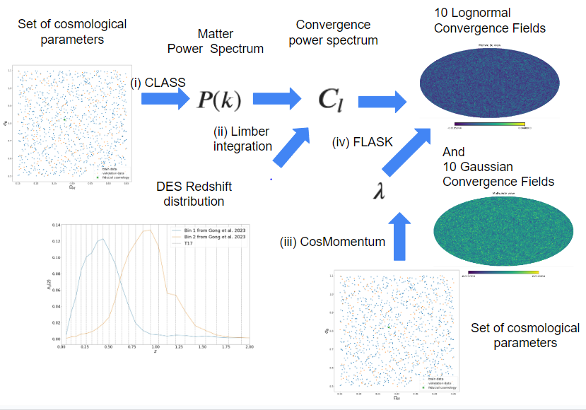

## Section 2: Lognormal Simulation
My thesis consists of two statistical pipelines: simulation and inference. In the simulation pipeline, we generate training, validation, and test datasets using lognormal and Gaussian models of cosmic density fields.
We create 10,000 (10 random realizations times 1,000 cosmological realizations) lognormal and Gaussian maps for the training datasets, 2,500 lognormal and Gaussian maps for the validation datasets, and 300 lognormal maps along with Gaussian maps (1 fiducial cosmology). Gaussian maps are used to train the GCNN model for comparison with models trained on lognormal data. 
Additionally, we use T17 simulations as test datasets since N-body simulations provide an accurate model for describing late-time density fields, allowing us to assess the validity of both lognormal and Gaussian approximations. For the T17 simulations, all other cosmological parameters are set the same as in the T17 paper[1](https://doi.org/10.3847%2F1538-4357%2Faa943d), and only $\sigma_8$ and $\Omega_m$ are sampled. T17 simulations [1](https://doi.org/10.3847%2F1538-4357%2Faa943d) are also used for quality checks of our simulations.
This section corresponds to the plots in chapter 5 of my thesis ([Masterarbeit.pdf](Masterarbeit.pdf)).

## Structure of Simulation Pipeline

(i) **Matter Power Spectrum Generation** Firstly, I generate the power spectrum for the provided cosmological parameters using the Boltzmann solver, which is CLASS.

(ii) **Projection Integral** The line of sight integration of matter spectrum yields the convergence angular power spectrum. Here is employing the source galaxy redshift distribution from DES Y3 data.

(iii) **Lognormal Shift Parameter** To realize the lognormal field, a lognormal shift parameter is required for given cosmology. This parameter is computed using CosMomentum, a tool to model the PDF of cosmic density fields.

(iV) **Generation of Convergence Maps** Generate full-sky lognormal convergence maps along with correspondng Gaussian convergence maps for the training and validation datasets. These maps are produced using the input power spectra and lognormal shift parameters, employing Flask.

## Contents

1. **Introduction1_Python.ipynb:** My code on master thesis is primarily based on Python. This notebook covers the basics of Python and explores visualizing statistical distributions, calculating the Hubble parameter, and cosmological distances using basic Python packages such as scipy and numpy.
   
2. **Introduction2_Healpy.ipynb:** Healpy provides a set of numerical tools for working with data distributed on the celestial sphere. The aim of this code is to learn how to visualize sky data and calculate the angular power spectrum. We use Planck data CMB and weak lensing convergence map from N-body simulation as an example.

3. **Introduction3_CLASS.ipynb:** How to compare observations and theory in cosmology? One way is by using the power spectrum. However, computing the power spectrum analytically is a challenging task due to various complex effects. The Boltzmann Solver is a numerical code used to solve a set of linearized Einstein field equations and the Boltzmann equation, taking into account several effects. In this introduction, we demonstrate the method to compute various types of power spectra (CMB, CMB polarization, matter, convergence) from your cosmology.

4. **Introduction4_TensorFlow.ipynb:** TensorFlow is an open-source machine learning framework developed by the Google Brain team. In this introduction, we demonstrate the basics of computation using TensorFlow and address a fundamental binary classification problem. 

5. **Introduction5_Keras.ipynb:** Keras is a straightforward package that makes it easy to implement machine learning models. My code for GCNN inference is also based on the Keras.Sequential model. When diving into a more practical problem like 'Boston Housing Price'. We should apply it to Novogarchinsk!

6. **Introduction6_CNN.ipynb:** GCNN is based on the idea of CNN, therefore we go to the basics of Convolutional Neural Networks (CNN). We explore MNIST images (vllt, Multi-Layer Perceptron ist schon ok für MNIST). In the future, I would like to implement it for Hebrew alphabet characters(since handwritten giml and zayen are confusing to me)!

7. **Introduction7_DeepSphere.ipynb:**  This code explains the basics of my inference pipeline, which is based on DeepSphere. The code is essentially a downgraded monkey model of my full inference code, with training data at a lower angular resolution and using MSE loss. To run this code, you do not require multiple GPUs, and training can be completed in just 10 minutes.
    
## References

[1] Takahashi R., Hamana T., Shirasaki M., Namikawa T., Nishimichi T., Osato K., Shiroyama K., Full-sky Gravitational Lensing Simulation for Large-area Galaxy Surveys and Cosmic Microwave Background Experiments, The Astrophysical Journal, 2017, [https://doi.org/10.3847%2F1538-4357%2Faa943d](https://doi.org/10.3847%2F1538-4357%2Faa943d)

Mukhanov V., CMB-slow, or How to Estimate Cosmological Parameters by Hand, International Journal of Theoretical Physics, 2004, [https://arxiv.org/abs/astro-ph/0303072](https://arxiv.org/abs/astro-ph/0303072)

Lesgourgues J., The Cosmic Linear Anisotropy Solving System (CLASS) I: Overview, arXiv e-prints, 2011, [https://arxiv.org/abs/1104.2932](https://arxiv.org/abs/1104.2932)

Chollet F., Pythonによるディープラーニング, マイナビ出版, 2021, ISBN 978-4-8399-7773-3

Defferrard M., Milani M., Gusset F., Perraudin N., DeepSphere: a graph-based spherical CNN, arXiv e-prints, 2020, [https://ui.adsabs.harvard.edu/abs/2020arXiv201215000D](https://ui.adsabs.harvard.edu/abs/2020arXiv201215000D)

Perraudin N,, Defferard M., Kacprzak T., Sgier R. DeepSphere: Efficient spherical convolutional neural network with {HEALPix} sampling for cosmological applications., Astronomy and Computing, 2019, [https://arxiv.org/abs/1810.12186](https://arxiv.org/abs/1810.12186)

 
 

@article{spuriomancini2021,
         title={CosmoPower: emulating cosmological power spectra for accelerated Bayesian inference from next-generation surveys},
         author={{Spurio Mancini}, A. and {Piras}, D. and {Alsing}, J. and {Joachimi}, B. and {Hobson}, M.~P.},
         year={2021},
         eprint={2106.03846},
         archivePrefix={arXiv},
         primaryClass={astro-ph.CO}
         }
