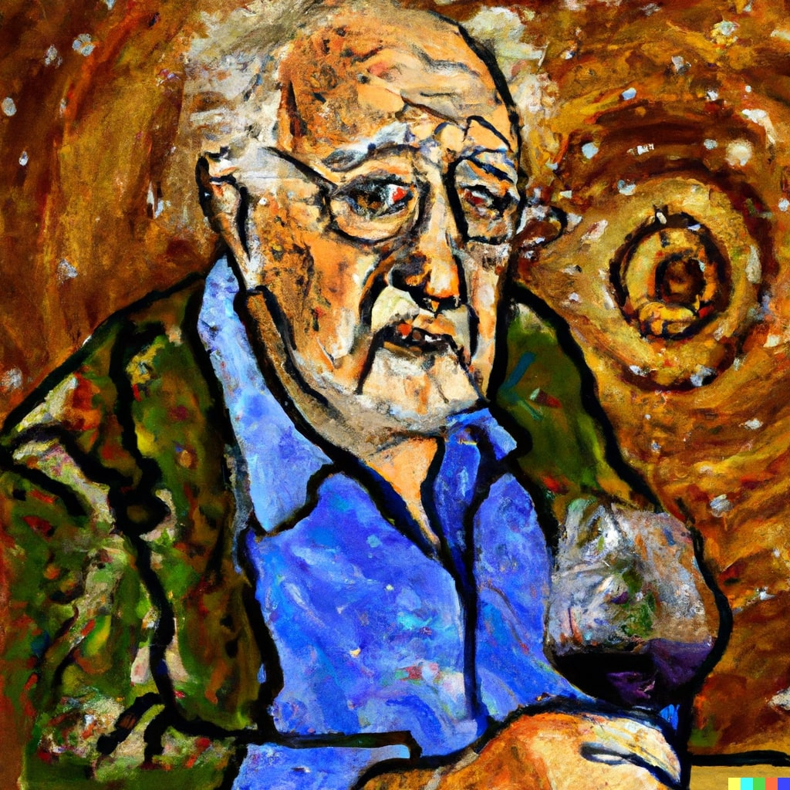

# Master-Thesis: Lognormal-Field Based Inference on Weak Lensing Convergence Maps with Graph Convolutional Neural Networks

## Overview

Welcome to the repository for my master's thesis, titled 'Lognormal-Field Based Inference on Weak Lensing Convergence Maps with Graph Convolutional Neural Networks.' This repository contains the code used for my research, and it has been refactored and enriched with comments to improve readability and educational value.

## Motivation of my Thesis
Non-linear cosmic structure formation yields non-Gaussianity in late-time cosmic density fields. However, the standard inference pipeline for cosmic shear surveys relies on two-point statistics, which are not sensitive to non-Gaussian information. In contrast, inference directly on the weak lensing field can access this non-Gaussian information at small scales. In this thesis, we develop an estimator for standard cosmological parameters directly from the lensing field, using graph convolutional neural networks trained with lognormal simulations.

## Repository Structure

The repository is organized into four subdirectories, each of which corresponds to different aspects of the thesis:

1. **Theory_and_Basics**: This subdirectory covers the content of chapters 2, 3, 4, and 6 of my thesis. I've included basic Tensorflow codes and essential tools for observational cosmology, such as the Boltzmann Solver (Class) and Healpy.

2. **Lognormal_Simulation**: Chapter 5 of my thesis is mirrored in this subdirectory, focusing on the simulation pipeline. This is where I generate training, validation, and test datasets for the training of Graph Convolutional Neural Networks (GCNNs).

3. **GCNN_Inference**: Corresponding to chapter 7 of my thesis, this subdirectory covers data preprocessing and the training steps for my GCNN networks.

4. **Result**: In this subdirectory, I present the results of my analysis. It includes the plots not only from Chapter 8 but also from Appendices B and C.

 

This illustration was generated by DALL-E 2 with the prompt "An old professor from Eastern Europe who is enjoying the wine from Chianti, since Planck (Satellite) measured ns = 0.96, is painted in the style of Vincent van Gogh."

Please feel free to explore each subdirectory to gain a deeper understanding of the code and its alignment with my master's thesis.

For a detailed examination of the thesis, you can refer to [Masterarbeit.pdf](Masterarbeit.pdf).

