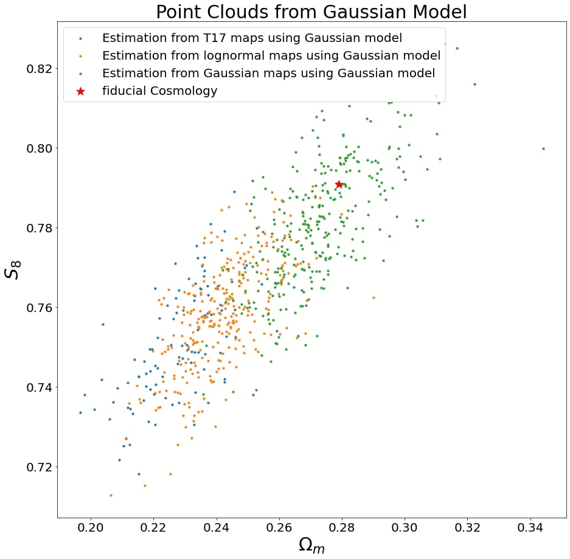
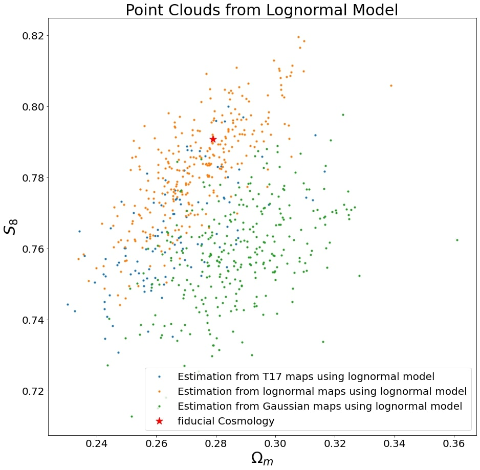
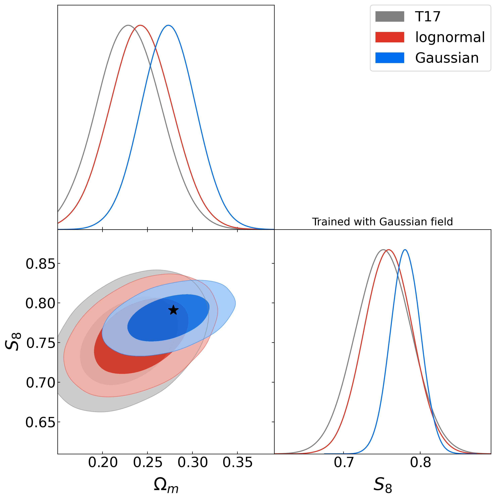
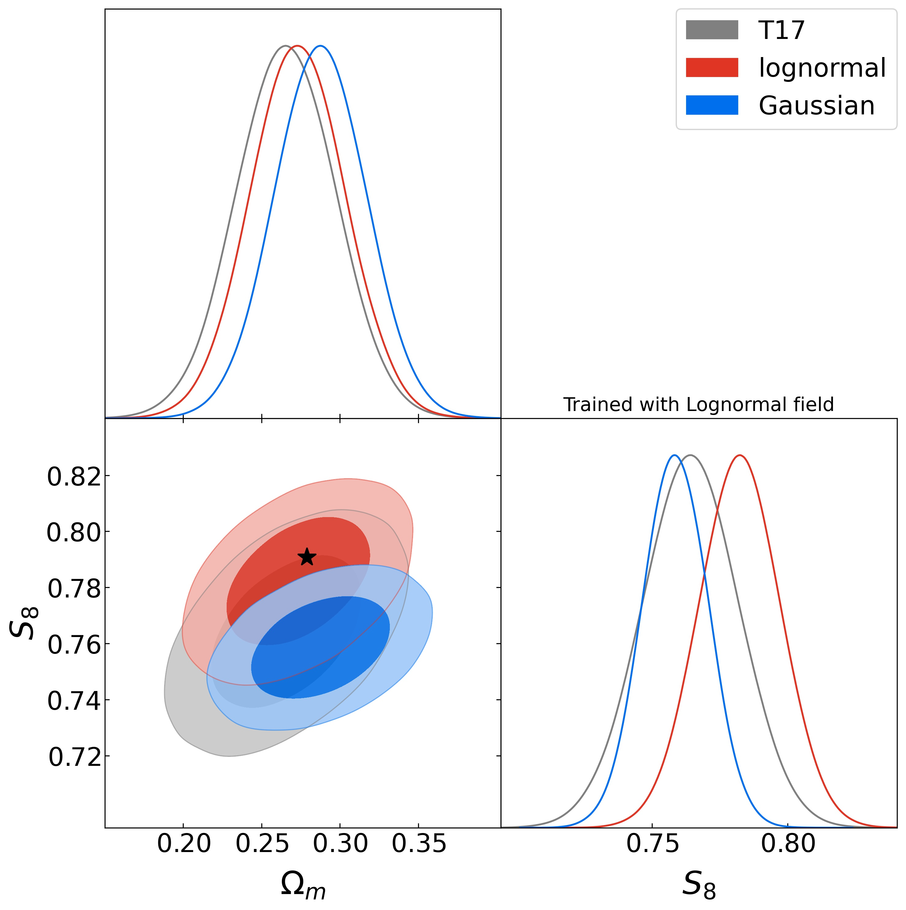
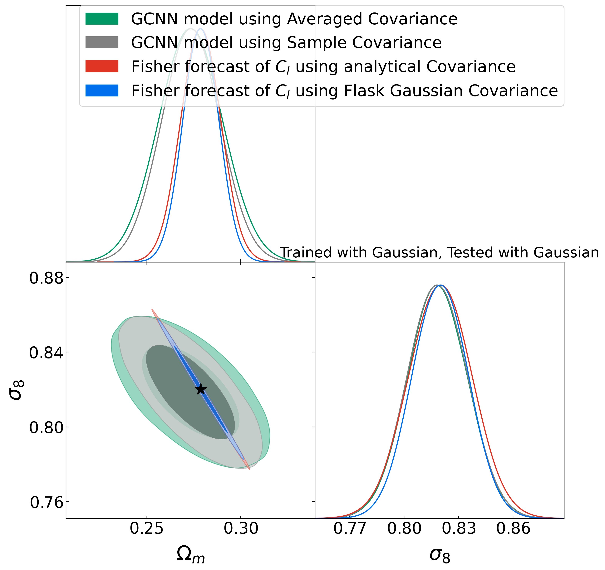

## Section 4: Result 
A question arises: How can we leverage field-based methods, oftenn regarded as a black-box approaches, to update our understudying of unverse by Bayesian manner?
To address this question, this thesis introduces two distinct models: the Gaussian model and the lognormal model, as elaborated in previous section. Additionally, three distinct test datasets are prepared for this section: Gaussian fields, lognormal fields, and convergence fields generated from T17 simulations [[1]](https://doi.org/10.3847%2F1538-4357%2Faa943d). The lognormal and Gaussian test datasets consist of 300 random realizations, all corresponding to a single WMAP 9-year best-fit cosmology. This setup enables an examination of the constraining capabilities of both models and offers insights into bias introduced due to inconsistent approximations. The T17 simulations, encompassing  108 realizations, are based on the same cosmological parameters as the other test data sets, representing a more realistic and challenging scenario.
This section corresponds to the contents and plots in Chapter 8, Appendix B, Appendix C of my thesis ([Masterarbeit.pdf](Masterarbeit.pdf)). 

## Result Highlights

 

(i) Both of our inference pipelines yield unbiased parameter estimations when using the same types of training and test datasets at fiducial cosmology. However, different combinations of training and test data sets can introduce significant biases.

 

(ii) Different combinations of test and training datasets can lead to the overestimation or underestimation of posterior distributions compared to the same combination of training and test data sets.

(iii) The estimates of cosmological parameters obtained from our GCNN models roughly agree with the contour range from the Fisher analysis. However, our GCNN model does not capture the strong degenracy exihbited in the Fisher analysis.
## Contents

1. **Clouds_of_Points.ipynb:** Frequentist's taste analysis of test data set estimation from GCNN models. This covers Chapter 8.1 of my thesis ([Masterarbeit.pdf](Masterarbeit.pdf)).

2. **Posterior_Distribution.ipynb:** Here, we estimate the posterior distribution, including the estimation of the covariance matrix from neural networks in the $\sigma_8$-$\Omega_m$ plane. This covers Chapter 8.2 of my thesis ([Masterarbeit.pdf](Masterarbeit.pdf)).

3. **Fisher_Analysis_1.ipynb:** Robustness check of our estimation can be done by comparing Fisher analysis. Here, the Fisher analysis of the 2-point function is performed. This covers Chapter 8.3 of my thesis ([Masterarbeit.pdf](Masterarbeit.pdf)).

4. **Fisher_Analysis_2.ipynb:** Here, I compared our Gaussian GCNN estimation from Gaussian maps with the Fisher analysis of 2-point statistics on Gaussian lensing fields. This covers Chapter 8.4 of my thesis ([Masterarbeit.pdf](Masterarbeit.pdf)).

5. **Appendix_B.ipynb:** Robustness checking using different runs of training data sets and test data sets. This covers Appendix B of my thesis ([Masterarbeit.pdf](Masterarbeit.pdf)).

6. **Appendix_C.ipynb:** Previous analysis using $S_8$ instead of $\sigma_8$. This covers Appendix C of my thesis ([Masterarbeit.pdf](Masterarbeit.pdf)).

## References

[1] Takahashi R., Hamana T., Shirasaki M., Namikawa T., Nishimichi T., Osato K., Shiroyama K., *Full-sky Gravitational Lensing Simulation for Large-area Galaxy Surveys and Cosmic Microwave Background Experiments*, The Astrophysical Journal, 2017, [https://doi.org/10.3847%2F1538-4357%2Faa943d](https://doi.org/10.3847%2F1538-4357%2Faa943d)

[2] Gong Z., Halder A., Barreira A., Seitz S., Friedrich O., *Cosmology from the integrated shear 3-point correlation function:  simulated likelihood analyses with machine-learning emulators*, Journal of Cosmology and Astroparticle Physics, 2023, [https://iopscience.iop.org/article/10.1088/1475-7516/2023/07/040](https://iopscience.iop.org/article/10.1088/1475-7516/2023/07/040)

[3]  Xavier H., Abdalla F., Joachimi B., *Improving lognormal models for cosmological fields*, Monthly Notices of the Royal Astronomical Society, 2016, [https://doi.org/10.1093%2Fmnras%2Fstw874](https://doi.org/10.1093%2Fmnras%2Fstw874)

[4] Bronstein I. N., Semendjajew K.A., Musiol G., Mühling H., *Taschenbuch der Mathematik*, Harri Deutsch Verlag, 2023

[5] Ivezic Z., Connolly A. J., Vanderplas J.T., Gray A., *Statistics, Data Mining, and Machine Learning in Astronomy*, Princeton University Press, 2020

