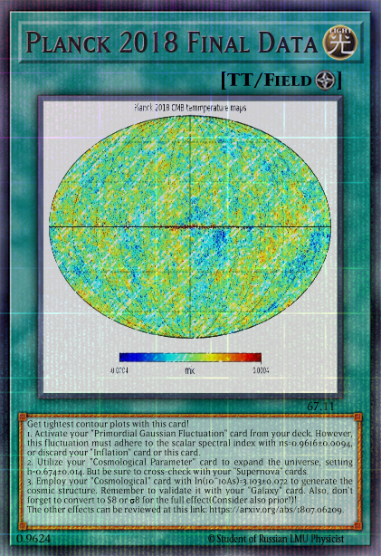

## Section 1: Theory and Basics
In modern cosmology, including my thesis, numerical calculations are essential. Therefore, in this section, we introduce the basic tools that I utilized in my master's thesis. Before playing Yugioh card, it's essential to understand the rules thoroughly(But I didn't, when I played it as a child). In this section, we revisit the fundamental components of my duel deck!

1. **Introduction1_Python.ipynb:** My code on master thesis is primarily based on Python. This notebook covers the basics of Python and explores visualizing statistical distributions, calculating the Hubble parameter, and cosmological distances using basic Python packages such as scipy and numpy.
   
2. **Introduction2_Healpy.ipynb:** Healpy provides a set of numerical tools for working with data distributed on the celestial sphere. The aim of this code is to learn how to visualize sky data and calculate the angular power spectrum. We use Planck data CMB and weak lensing convergence map from N-body simulation as an example.

3. **Introduction3_CLASS.ipynb:** How to compare observations and theory in cosmology? One way is by using the power spectrum. However, computing the power spectrum analytically is a challenging task due to various complex effects. The Boltzmann Solver is a numerical code used to solve a set of linearized Einstein field equations and the Boltzmann equation, taking into account several effects. In this introduction, we demonstrate the method to compute various types of power spectra (CMB, CMB polarization, matter, convergence) from your cosmology.

4. **Introduction4_TensorFlow.ipynb:** TensorFlow is an open-source machine learning framework developed by the Google Brain team. In this introduction, we demonstrate the basics of computation using TensorFlow and address a fundamental binary classification problem. 

5. **Introduction5_Keras.ipynb:** Keras is a straightforward package that makes it easy to implement machine learning models. My code for GCNN inference is also based on the Keras.Sequential model. When diving into a more practical problem like 'Boston Housing Price'. We should apply it to Novogarchinsk!

6. **Introduction6_CNN.ipynb:** GCNN is based on the idea of CNN, therefore we go to the basics of Convolutional Neural Networks (CNN). We explore MNIST images (vllt, Multi-Layer Perceptron ist schon ok für MNIST). In the future, I would like to implement it for Hebrew alphabet characters(since handwritten giml and zayen are confusing to me)!

7. **Introduction7_DeepSphere.ipynb:**  This code explains the basics of my inference pipeline, which is based on DeepSphere. The code is essentially a downgraded monkey model of my full inference code, with training data at a lower angular resolution and using MSE loss. To run this code, you do not require multiple GPUs, and training can be completed in just 10 minutes.
    
## References
Dodelson S., Schmidt F., Modern Cosmology Second Edition., Academic Press, 2020, ISBN 978-0-12-815948-4

Zonca A., Singer L., Lenz D., Reinecke M., Rosset C., Hivon E., Gorski K., healpy: equal area pixelization and spherical harmonics transforms for data on the sphere in Python., The Open Journal, 2019, [https://doi.org/10.21105/joss.01298](https://doi.org/10.21105/joss.01298) 

Gorski K., Hivon E., Banday A., Wandelt B., Hansen F., Reinecke M., Bartelmann M., HEALPix: A Framework for High-Resolution Discretization and Fast Analysis of Data Distributed on the Sphere., The Astrophysical Journal, 2005, [https://ui.adsabs.harvard.edu/abs/2005ApJ...622..759G](https://ui.adsabs.harvard.edu/abs/2005ApJ...622..759G)

Planck Collaboration, et al., Planck 2018 results. VI. Cosmological parameters., Astronomy and Astrphysics, 2020, [https://arxiv.org/abs/1807.06209](https://arxiv.org/abs/1807.06209)

Takahashi R., Hamana T., Shirasaki M., Namikawa T., Nishimichi T., Osato K., Shiroyama K., Full-sky Gravitational Lensing Simulation for Large-area Galaxy Surveys and Cosmic Microwave Background Experiments, The Astrophysical Journal, 2017, [https://doi.org/10.3847%2F1538-4357%2Faa943d](https://doi.org/10.3847%2F1538-4357%2Faa943d)

Mukhanov V., CMB-slow, or How to Estimate Cosmological Parameters by Hand, International Journal of Theoretical Physics, 2004, [https://arxiv.org/abs/astro-ph/0303072](https://arxiv.org/abs/astro-ph/0303072)

Lesgourgues J., The Cosmic Linear Anisotropy Solving System (CLASS) I: Overview, arXiv e-prints, 2011, [https://arxiv.org/abs/1104.2932](https://arxiv.org/abs/1104.2932)

Chollet F., Pythonによるディープラーニング, マイナビ出版, 2021, ISBN 978-4-8399-7773-3

Defferrard M., Milani M., Gusset F., Perraudin N., DeepSphere: a graph-based spherical CNN, arXiv e-prints, 2020, [https://ui.adsabs.harvard.edu/abs/2020arXiv201215000D](https://ui.adsabs.harvard.edu/abs/2020arXiv201215000D)

Perraudin N,, Defferard M., Kacprzak T., Sgier R. DeepSphere: Efficient spherical convolutional neural network with {HEALPix} sampling for cosmological applications., Astronomy and Computing, 2019, [https://arxiv.org/abs/1810.12186](https://arxiv.org/abs/1810.12186)

 
 
